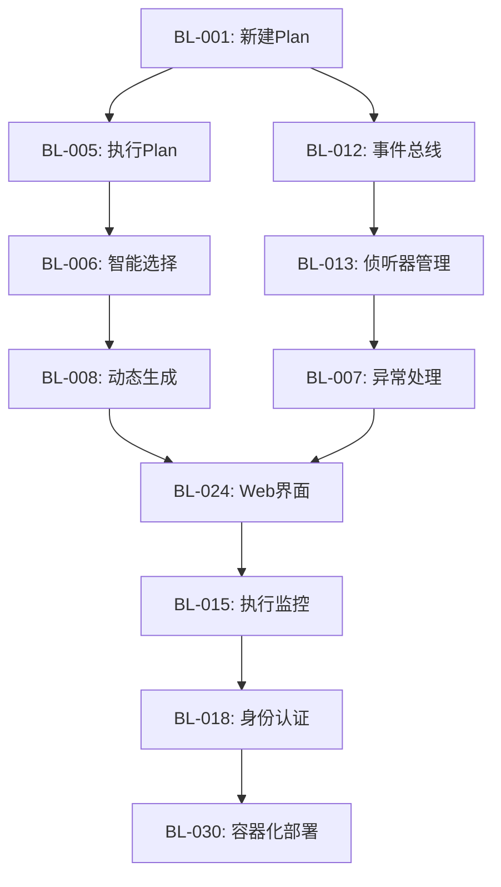

# AIntegration 项目 Backlog

## 项目概述
AIntegration 是一个基于 AI 的智能集成平台，通过 Agent 和 Plan 机制实现复杂业务流程的自动化执行。

## 核心功能需求

### 1. Plan 管理
- **BL-001**: 新建 Plan
  - 支持从配置文件创建 Plan
  - 支持从模板创建 Plan
  - 支持通过 API 动态创建 Plan
  - 支持 Plan 的元数据管理

- **BL-002**: 修改 Plan（版本保护）
  - 实现 Plan 版本控制系统
  - 支持 Plan 的增量更新
  - 支持 Plan 的回滚功能
  - 支持 Plan 的变更历史记录

- **BL-003**: 删除 Plan
  - 支持软删除和硬删除
  - 支持 Plan 的依赖检查
  - 支持 Plan 的批量删除

- **BL-004**: 查询 Plan
  - 支持按名称、标签、状态查询
  - 支持全文搜索
  - 支持高级过滤条件
  - 支持分页和排序

### 2. Plan 执行
- **BL-005**: 输入提示词执行 Plan（关键特性）
  - 支持自然语言提示词解析
  - 支持上下文变量注入
  - 支持执行参数验证
  - 支持plan执行后的Trace查询，用于溯源
  - [增强] 主任务完成或无侦听器/错误场景触发 Planner：
    - 通过 A2A 查询 HR/Inventory/Access 系统状态（profile/outbound/access）
    - 若缺失则动态创建任务与侦听器（基于配置化 BizAgent）
    - 收敛条件满足后触发 send_email（侦听 004/005 Done）

- **BL-006**: AgentPlanner 智能选择
  - 实现意图识别算法
  - 支持 Plan 匹配度评分
  - 支持多 Plan 候选排序
  - 支持用户确认机制

- **BL-007**: 异常 Plan 执行处理
  - 实现异常检测机制
  - 支持自动侦听器补充
  - 支持 Plan 动态调整
  - 支持执行回滚

- **BL-008**: 动态 Plan 生成
  - 支持基于 Few-shot 学习生成
  - 支持模板化 Plan 生成
  - 支持 Plan 质量评估
  - 支持用户反馈学习

### 3. Agent 管理
- **BL-009**: Agent 注册与发现
  - 支持 Agent 自动注册
  - 支持 Agent 能力描述
  - 支持 Agent 健康检查
  - [新增] 引入 A2AClient 抽象，默认对接内置 A2AServer，后续可替换官方 A2A 包

- **BL-010**: Agent 执行引擎
  - 支持 Agent 任务调度
  - 支持 Agent 并发执行
  - 支持 Agent 执行监控

- **BL-011**: Agent 工具集成
  - 支持工具动态注册
  - 支持工具参数验证
  - 支持工具执行日志
  - [合规] BizAgent 全部以配置化方式生成与注册（Agent Card），不落地实体代码

### 4. 智能规划
- **BL-014**: 微动态规划（已完成 ✅）
  - 任务失败自动重试机制
  - 智能重试策略（可配置重试次数）
  - 超过重试次数后主任务进入 Error 状态
  - 计划恢复 (Resume) API
  - 重试记录追踪和上下文管理
  - 状态: **已完成**
  - 测试:
    - test_bl014_micro_planning.py: 基础重试测试
    - test_bl005_resume_scenario.py: 端到端 Resume 场景
    - test_bl005: Will Zhang 入职流程重试测试

- **BL-014.1**: 参数暂停与继续（新增 🆕）
  - Agent执行时识别到缺少必需参数
  - PlanInstance自动进入PAUSE状态
  - 通过continue() API传入参数继续执行
  - 类似resume机制但用于参数补充而非错误恢复
  - 状态: **待实现**
  - 优先级: **P0 - 核心功能**
  - 使用场景:
    - 申请电脑时缺少电脑型号
    - 发送邮件时缺少收件人
    - 创建账号时缺少用户名

- **BL-014.2**: 智能组件生成系统（新增 🆕）
  - BizAgent智能判断生成哪种UI组件类型
  - 支持组件类型: input, radio, checkbox, select, combobox, list, password, date, number等
  - 动态数据源: 从工具列表和A2A查询获取选项数据
  - 智能决策引擎: 基于参数名称、上下文、数据源自动选择组件类型
  - 状态: **待实现**
  - 优先级: **P0 - 核心功能**

- **BL-014.3**: TODO分配系统（新增 🆕）
  - 生成交互任务并分配给相应角色的人员
  - 支持参数输入、审批、审核等多种TODO类型
  - 智能分配策略: 基于角色、工作负载、部门等
  - 客户端集成: 在工作流程中直接显示TODO，或跳转到TODO管理页面
  - 状态: **待实现**
  - 优先级: **P0 - 核心功能**

- **BL-014.4**: 管理系统（新增 🆕）
  - 用户与角色管理: 创建用户、分配角色、权限控制
  - 应用配置管理: HR、IT、财务等应用的配置管理
  - A2A管理: Agent注册、发现、健康检查
  - MCP配置管理: 工具注册、分类、Schema验证
  - 工作流管理: 流程定义、监控、审计日志
  - 状态: **待实现**
  - 优先级: **P1 - 重要功能**

- **BL-015**: 完全动态规划（计划中）
  - LLM 分析失败原因
  - 自动生成修复任务和侦听器
  - 从历史失败中学习
  - 自愈能力
  - 状态: **待开发**

### 5. 事件驱动系统
- **BL-012**: 事件总线
  - [增强] ListenerEngine 支持注册 Planner 回调，覆盖：
    - 无侦听器命中（orphaned）
    - 任务 Error
    - 主任务 Done 收敛
  - 实现事件发布/订阅机制
  - 支持事件路由和过滤
  - 支持事件持久化

- **BL-013**: 侦听器管理
  - 支持侦听器动态注册
  - 支持条件表达式解析
  - 支持侦听器优先级

- **BL-014**: 状态管理
  - 支持任务状态机
  - 支持状态转换验证
  - 支持状态历史记录

### 5. 监控与运维
- **BL-015**: 执行监控
  - 支持实时执行状态监控
  - 支持执行性能指标
  - 支持执行日志聚合

- **BL-016**: 系统监控
  - 支持系统资源监控
  - 支持服务健康检查
  - 支持依赖服务监控

- **BL-017**: 数据分析
  - 支持执行数据分析
  - 支持性能趋势分析
  - 支持优化建议生成

### 6. 安全与权限
- **BL-018**: 身份认证
  - 支持多种认证方式
  - 支持单点登录（SSO）
  - 支持多租户隔离

- **BL-019**: 权限控制
  - 支持基于角色的访问控制（RBAC）
  - 支持资源级权限控制
  - 支持操作审计日志

- **BL-020**: 数据安全
  - 支持数据加密存储
  - 支持敏感数据脱敏
  - 支持数据备份恢复

### 7. 集成与扩展
- **BL-021**: 外部系统集成
  - 支持 REST API 集成
  - 支持 GraphQL 集成
  - 支持消息队列集成

- **BL-022**: 插件系统
  - 支持插件动态加载
  - 支持插件生命周期管理
  - 支持插件依赖管理

- **BL-023**: 配置管理
  - 支持多环境配置
  - 支持配置热更新
  - 支持配置版本控制

### 8. 用户体验
- **BL-024**: Web 界面
  - 支持 Plan 可视化编辑
  - 支持执行流程监控
  - 支持日志查看

- **BL-025**: API 接口
  - 支持 RESTful API
  - 支持 GraphQL API
  - 支持 WebSocket 实时通信

- **BL-026**: 命令行工具
  - 支持 Plan 管理命令
  - 支持执行监控命令
  - 支持系统维护命令

### 9. 测试与质量
- **BL-027**: 单元测试
  - 支持核心模块单元测试
  - 支持测试覆盖率统计
  - 支持测试自动化

- **BL-028**: 集成测试
  - 支持端到端测试
  - 支持性能测试
  - 支持压力测试

- **BL-029**: 质量保证
  - 支持代码质量检查
  - 支持安全漏洞扫描
  - 支持依赖更新检查

### 10. 部署与运维
- **BL-030**: 容器化部署
  - 支持 Docker 容器化
  - 支持 Kubernetes 部署
  - 支持服务编排

- **BL-031**: CI/CD 流水线
  - 支持自动化构建
  - 支持自动化测试
  - 支持自动化部署

- **BL-032**: 运维工具
  - 支持日志收集分析
  - 支持指标监控告警
  - 支持故障诊断

## 优先级分类

### P0 - 核心功能（必须实现）
- BL-001, BL-002, BL-003, BL-004: Plan 管理
- BL-005, BL-006: Plan 执行
- BL-009, BL-010, BL-011: Agent 管理
- BL-012, BL-013, BL-014: 事件驱动系统
- BL-015: 执行监控

### P1 - 重要功能（应该实现）
- BL-007, BL-008: 异常处理和动态生成
- BL-016, BL-017: 系统监控和数据分析
- BL-018, BL-019: 身份认证和权限控制
- BL-024, BL-025: Web 界面和 API

### P2 - 增强功能（可以实现）
- BL-020: 数据安全
- BL-021, BL-022, BL-023: 集成与扩展
- BL-026: 命令行工具
- BL-027, BL-028, BL-029: 测试与质量

### P3 - 未来功能（可以考虑）
- BL-030, BL-031, BL-032: 部署与运维
- 机器学习优化
- 高级可视化
- 移动端支持

## 需求依赖关系

## 验收标准

每个需求都需要满足以下验收标准：
1. 功能完整性：需求描述的功能完全实现
2. 测试覆盖：单元测试和集成测试覆盖
3. 文档完整：API 文档和用户文档
4. 性能达标：满足性能要求
5. 安全合规：通过安全审查